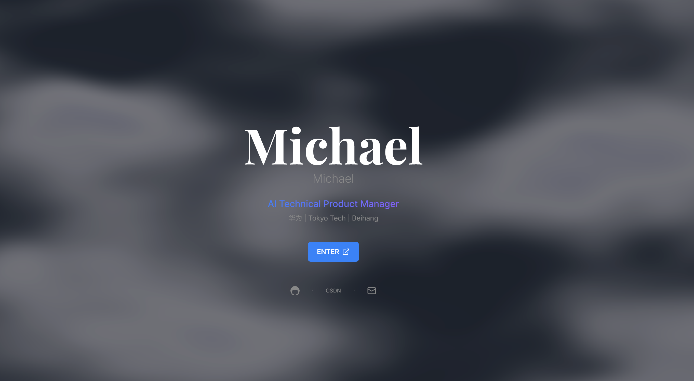

# Michael's Personal Website

A modern, bilingual (EN/ZH) personal portfolio website featuring WebGL animated backgrounds, built with Next.js 16, React 19, and Tailwind CSS v4.

**Live Site:** [my-website-zeta-seven.vercel.app](https://my-website-zeta-seven.vercel.app)

## Features

- **WebGL Animated Backgrounds** — Liquid metal shader on intro page, deep ocean light refraction shader on all sub-pages
- **Bilingual Support** — Full English/Chinese toggle with localStorage persistence (English default)
- **Interactive Intro** — Enter animation with liquid metal fluid background
- **Clickable Avatar** — Click to toggle between two profile photos on the main page
- **Timeline Layout** — Work experience and projects displayed in vertical timeline with expandable cards
- **Privacy Controls** — No real name displayed, no phone number, resume download requires email approval
- **Responsive Design** — Mobile-friendly layout with Tailwind CSS

## Pages

| Page | Route | Description |
|------|-------|-------------|
| Intro | `/` | Animated liquid metal intro with enter button |
| Main | `/main` | Profile hub with avatar, navigation cards, deep ocean background |
| About | `/about` | Education, expertise, leadership, philosophy |
| Experience | `/experience` | 5 work experiences in expandable timeline |
| Projects | `/projects` | 5 project cards with detailed metrics and outcomes |
| Contact | `/contact` | Contact form, social links, resume request via email |
| Skills | `/skills` | Technical skills overview |
| Blog | `/blog` | Blog placeholder |



## Tech Stack

- **Framework:** Next.js 16.2.1 (App Router, Turbopack)
- **UI:** React 19, Tailwind CSS v4, Framer Motion 12
- **Graphics:** WebGL (GLSL shaders), Canvas2D
- **Language:** TypeScript 5
- **Deployment:** Vercel

## Project Structure

```
app/
├── page.tsx              # Intro page (FluidBackground WebGL)
├── main/page.tsx         # Main hub (WaveBackground WebGL)
├── about/page.tsx        # About page
├── experience/page.tsx   # Work experience
├── projects/page.tsx     # Project portfolio
├── contact/page.tsx      # Contact & resume request
├── layout.tsx            # Root layout (LanguageProvider)
components/
├── FluidBackground.tsx   # WebGL liquid metal shader (intro)
├── WaveBackground.tsx    # WebGL deep ocean shader (sub-pages)
├── PageLayout.tsx        # Shared layout with WaveBackground
├── ProjectCard.tsx       # Expandable project card
├── Timeline.tsx          # Expandable timeline card
├── LanguageToggle.tsx    # EN/ZH floating toggle
├── NavigationCard.tsx    # Main page nav card
context/
├── LanguageContext.tsx    # React Context + localStorage
lib/
├── config.ts             # All site data (bilingual)
```

## Getting Started

```bash
# Install dependencies
npm install

# Run development server
npm run dev

# Build for production
npm run build

# Deploy to Vercel
vercel --prod
```

## Deployment

Deployed on [Vercel](https://vercel.com). To update:

```bash
vercel --prod
```

Site settings: [Vercel Dashboard](https://vercel.com/cnma640302-1991s-projects/my-website/settings)
